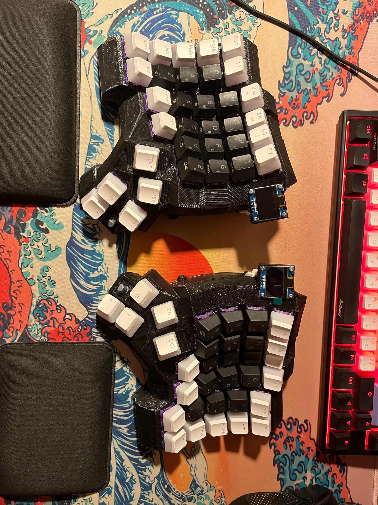
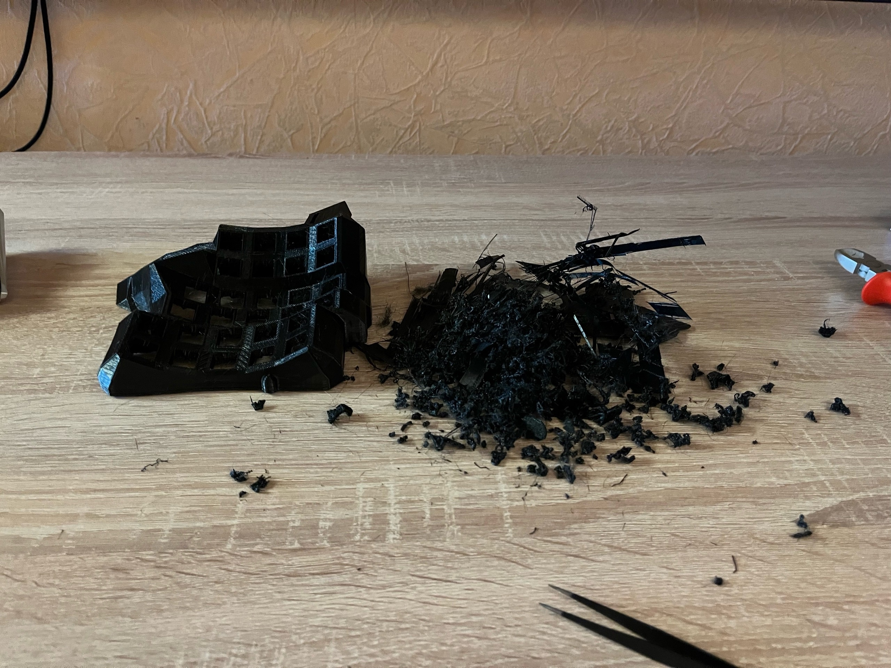
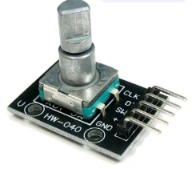
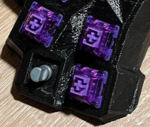

# Dactyl custom split wireless keyboard

My custom wireless keyboard without using printed circuit boards. All soldering is done by canopy using wires and diodes. The microcontroller uses an analog of nice!nano, [(NRF52840)(Pro Micro)](https://aliexpress.ru/item/1005006035267231.html?spm=a2g2w.orderdetail.0.0.4cc84aa62AqC6x&sku_id=12000035421753155).

All models stored here in data/models

Other keycaps.

## Keyboard case

Keyboard case created by using [online generator](https://ryanis.cool/dactyl/#manuform) and modyfied in Blender. Model have a problem with a structure, but gCode was created successfuly (OrcaSlicer). All printed on the 3D FDM printer.

Since it was difficult to calculate the size of the hole for the usb and for the power and reboot button, it was decided to melt them with a soldering iron after printing.

## Board power supply

523450 1000mAh rechargeable batteries are used to provide the board.

## Soldering

Long wires are necessary so that you can remove the lid and not break anything. Everything does not look neat, but it is soldered very efficiently. Detachable adapters for 2.54 are attached to the legs of the microcontroller, which will allow you to change the board without soldering if it fails.

## Encoders

Standard encoders used for developments under Arduino were used. For embedding, the encoders were unsoldered from the board and an adapter was inserted. The adapter was also printed on a 3D printer and is an element replacing the switch.
Caps were additionally printed on the encoders.

## Oled displays

The displays were ssd1306 (128x64). They use standard ZMK widgets and display all the necessary information. The configuration took some fiddling. All the settings can be found in the source code.

## Keymap

The keyboard layout is not complete.

## Todo

In the future I would like to use self-written widgets for OLED screens, but now it is not possible. As an example, I managed to run the finished code. I will simply attach a photo.

